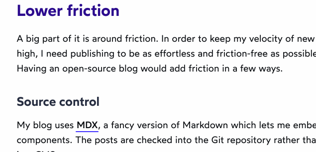
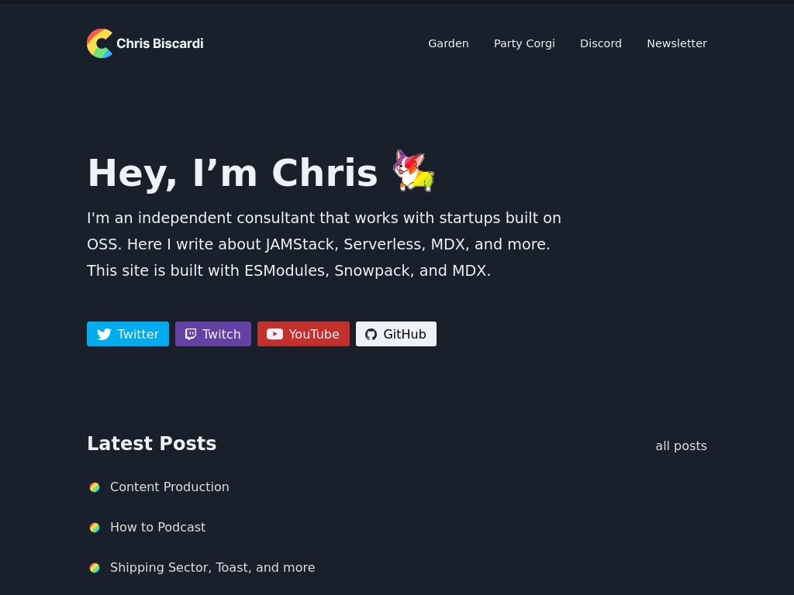

As I was going through rebuilding [my blog](https://jonkuperman.com/), I spent a lot of time looking at other people's sites trying to get inspiration. Below is a list of my absolute favorite blog designs and my favorite thing about them.

## 1. joshwcomeau.com

What's not to love about this website? It might be my favorite personal blog design of all time.

### Things I love about joshwcomeau.com

1. Light / Dark mode toggle
1. Amazing illustrated image of the author
1. Fun sounds!
1. Little interactive heart to click on each post

### My favorite thing about it:

**The links!**

Seriously, look at what happens when you hover over one of these links:

I tried figuring out how these work. If you open the network panel in your devtools you'll see it doesn't make a request on hover. I think he must have some sort of build task that crawls his pages, finds links, takes screenshots of each link and then saves them to the post.

I've been thinking about recreating this just for fun but reading Josh's blog is always such a great experience!

## 2. wesbos.com

Wes **literally** just finished rebuilding his blog!

<Tweet tweetLink="wesbos/status/1252618566139928576" />

Check out how amazing it looks:

### Things I love about wesbos.com

1. The typography
1. The amazing breakpoints
1. The content! Free courses, premium courses, a podcast!

### My favorite thing about it:

**The open graph images**

If you link to any of Wes' posts on Twitter or Facebook, you'll notice that the embedded image is actually a screenshot of the post you are linking to! You might be wondering:

> Does Wes write a post, screenshot it and then save the file to his blog before publishing?

No, he doesn't! He has a Netlify function that runs on deploy that does this automatically for him! Check it out [here](https://github.com/wesbos/wesbos/blob/master/functions/ogimage/ogimage.js)!

Here is an example post:

<Tweet tweetLink="wesbos/status/1252619804994703361" />

## 3. christopherbiscardi.com

Chris writes so much great content on his blog! It's full of amazing posts on JAMstack, MDX, Gatsby and more! And just look at it.

### Things I love about christopherbiscardi.com

1. The rainbows!
1. It's so clean. Great use of space
1. This little guy

### My favorite thing about it:

**The Rainbows**

Seriously, they are everywhere and I love them. Check out this little animation at the top as you scroll through an article.

## 4. chriscoyier.net

Chris is the owner of the amazing [css-tricks](https://css-tricks.com/) website, but it's actually his personal site that I found inspiring!

### Things I love about chriscoyier.net

1. It's so personal. I feel like I know a bit about him just from viewing his page.
1. It's right to the point. Need to contact? Write a guest post? Whatever it is, there's a link for that.

### My favorite thing about it:

**This form**

Check this out!

