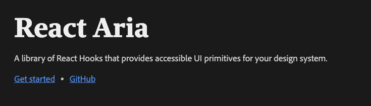

Design systems are great. Working at large companies like Adobe, it's easy to quickly build functional UIs using a robust design system and component library like [React-Spectrum](https://react-spectrum.adobe.com/react-spectrum/).

## Terminology

For this post, I'll be referring to the collection of icons, images, fonts, color schemes, and general guidelines as a **design system** and the actual collection of JavaScript, HTML, and CSS as a **component library**. Component libraries implement design systems.

## The problem with component libraries

One issue with most design system component libraries is that they offer two different things in one "take-all or none" package. Component libraries offer:

1. A rich UI for elements helping them seamlessly blend in with the design system.
1. A lot of functionality to help manage user interactions and normalize browser quirks.

The first offering is great if you're building something that needs to look like the design system you're using. For example, if you're building a mobile web app for Android, then using [Material UI](https://material-ui.com/) might be a great library to use. It will make everything look like Google's [Material Design](https://material.io/design), and you'll get a ton of free functionality. If you're building a product that you hope to monetize, maybe having it look like a Google app isn't what you want.

This is what makes so many folks unable to use component libraries. Small teams building new products would **love** to quickly develop their app with all the functionality that a component library like Material UI or React Spectrum provides. But they don't want their apps looking like an Adobe product.

## Introducing React-ARIA

The team behind React Spectrum has been hard at work rewriting their component library over the last few years. One of the coolest things that came of the rewrite is they broke each component out into three pieces—the component's state, functionality, and rendering logic. They released three separate packages on npm for just this purpose.

1. [@react-spectrum](https://github.com/adobe/react-spectrum/tree/main/packages/%40react-spectrum) - The full component. Adobe UI, functionality and state.
1. [@react-stately](https://github.com/adobe/react-spectrum/tree/main/packages/%40react-stately) - State management for the component.
1. [@react-aria](https://github.com/adobe/react-spectrum/tree/main/packages/%40react-aria) - Accessibility and behavior for the component.

One of the creators, [Devon Govett](https://twitter.com/devongovett) gave a great talk about React Spectrum at React Europe.

<YouTube youTubeId="dxDcBB7Xoxs" />

## Prior art

This project reminds me a lot of [Downshift](https://github.com/downshift-js/downshift) by [Kent C. Dodds](https://twitter.com/kentcdodds). Downshift provides a set of hooks for Combobox, Select and MultipleSelect.

## An example

Let's check out how these libraries work together using a listbox as an example!

A listbox is a list of options where a user can select one or more. Here's what one looks like:


## React Stately

Not incredibly useful on its own, but the @react-stately selection component will return all the props needed to pass into the listbox component so that it can maintain its own state.

```jsx
let [selectedKeys, setSelectedKeys] = useState(new Set());

<ListBox selectedKeys={selectedKeys} onSelectionChange={setSelectedKeys}>
  <Item key="one">One</Item>
  <Item key="two">Two</Item>
  <Item key="three">Three</Item>
</ListBox>
}
```

## React Aria

Let's build our own listbox and option components with nothing but React and @react-aria.

```jsx
import { useListState } from '@react-stately/list';
import { Item } from '@react-stately/collections';
import { useFocusRing } from '@react-aria/focus';
import { mergeProps } from '@react-aria/utils';

function ListBox(props) {
    // Create state based on the incoming props
    let state = useListState(props);

    // Get props for the listbox element
    let ref = React.useRef();
    let { listBoxProps, labelProps } = useListBox(props, state, ref);

    return (
        <>
            <div {...labelProps}>{props.label}</div>
            <ul
                {...listBoxProps}
                ref={ref}
                style={{
                    padding: 0,
                    margin: '5px 0',
                    listStyle: 'none',
                    border: '1px solid gray',
                    maxWidth: 250,
                }}
            >
                {[...state.collection].map((item) => (
                    <Option key={item.key} item={item} state={state} />
                ))}
            </ul>
        </>
    );
}

function Option({ item, state }) {
    // Get props for the option element
    let ref = React.useRef();
    let isDisabled = state.disabledKeys.has(item.key);
    let isSelected = state.selectionManager.isSelected(item.key);
    let { optionProps } = useOption(
        {
            key: item.key,
            isDisabled,
            isSelected,
        },
        state,
        ref
    );

    // Determine whether we should show a keyboard
    // focus ring for accessibility
    let { isFocusVisible, focusProps } = useFocusRing();

    return (
        <li
            {...mergeProps(optionProps, focusProps)}
            ref={ref}
            style={{
                background: isSelected ? 'blueviolet' : 'transparent',
                color: isSelected ? 'white' : null,
                padding: '2px 5px',
                outline: isFocusVisible ? '2px solid orange' : 'none',
            }}
        >
            {item.rendered}
        </li>
    );
}

<ListBox label="Choose an option" selectionMode="single">
    <Item>One</Item>
    <Item>Two</Item>
    <Item>Three</Item>
</ListBox>;
```

## React Spectrum

Putting it all together, we could use the top level @react-spectrum library to render a button with all its state and functionality!

```jsx
import { Button } from '@adobe/react-spectrum';

<Button variant="cta">Save</Button>;
```

## The great thing about React Aria

Imagine you're in the situation described above. You're building a web application, and you want to make sure it's robust and accessible, but you don't want it to look like a Google product.

React Aria gives you the power to build your custom UI while still getting all of the browser support, accessibility, and functionality of a component library. Imagine building your own custom checkbox and not having to worry about making it accessible because you can simply `import {useCheckbox} from '@react-aria/checkbox'` and add the resulting props to your custom element!

Imagine building a custom button element and not having to worry about a proper focus ring because you can just:

```jsx
import { useFocusRing } from '@react-aria/focus';

function Example() {
    let { isFocusVisible, focusProps } = useFocusRing();

    return (
        <button
            {...focusProps}
            style={{
                WebkitAppearance: 'none',
                appearance: 'none',
                background: 'green',
                border: 'none',
                color: 'white',
                fontSize: 14,
                padding: '4px 8px',
                outline: isFocusVisible ? '2px solid dodgerblue' : 'none',
                outlineOffset: 2,
            }}
        >
            Test
        </button>
    );
}
```

## Should you use React Aria?

If you are building a design system, and are not willing to put in the work to make your custom components fully accessible, you should use React Aria! Do you have a custom select component? Does it support browser autocomplete? No? Check out React Aria!

## The TL;DR

I look at React Aria, and I think:

> Finally, I can bootstrap my app with a component library and not have it look like a Google product!

Are you using React Aria for your component library?
