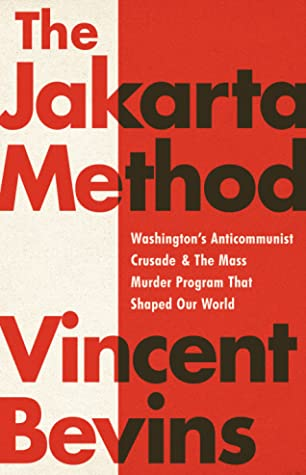

A few days before Christmas I found this amazing Twitter thread:

https://twitter.com/polina_marinova/status/1342213858795118592

It's a list of 10 questions that did, in fact, spark interesting dinner conversation! We had a few family members over (our quarantine pod during COVID) and we went through the list together!

One of the questions that stood out to me was:

https://twitter.com/polina_marinova/status/1342213859818557441

This was the first time I ever heard the phrase "content diet". The question sort of had me spinning at first. I read a lot. But I don't read a lot that I would consider "upper limit content". I read blog posts, news articles, a few books and every once in a long while I read something that blows my mind. If David Brooks is right, I'm not doing myself enough favors!

## Adding an upper limit book

I decided that I should, at any given time, be consuming some content that feels upper limit. I enjoy reading blog posts and news articles, so I'm not going to cut down on them. But I do want to always be reading something that is dramatically improving my content diet.

What upper limit content am I reading right now? [The Jakarta Method](https://www.goodreads.com/en/book/show/53054943-the-jakarta-method) by [Vincent Bevins](https://twitter.com/Vinncent)!

I figured working through a great book at all times would give me a constant upper limit and would therefore improve my mind! 😅

## Never far from a great idea

I followed [Polina Marinova](https://twitter.com/polina_marinova) on Twitter when I found the original thread. A few months later I saw a YouTube clip in my Twitter timeline. A preview for an interview with an author. In the clip he talks about keeping piles of books in his office, his living room and his bedroom. He says he's not reading them all, but he loves surrounding himself with great books. He says that makes is so he's

> I'm never far from a good idea.

The entire interview is great. He talks about building a platform, the power of good habits and finding your own voice.

<iframe width="560" height="315" src="https://www.youtube.com/embed/rC13mXUORBs" frameborder="0" allow="accelerometer; autoplay; clipboard-write; encrypted-media; gyroscope; picture-in-picture" allowfullscreen></iframe>

## What is your upper limit?

I'm not a huge fan of life hacking or self help content. But, the theory of maximum taste resonated with me. Also, surrounding myself with amazing books sounds like a fun idea! What do you all think? Do you believe in David's theory? What do you to do improve your content diet? Message me on [Twitter](https://twitter.com/jkup), I'd love to hear your thoughts!
