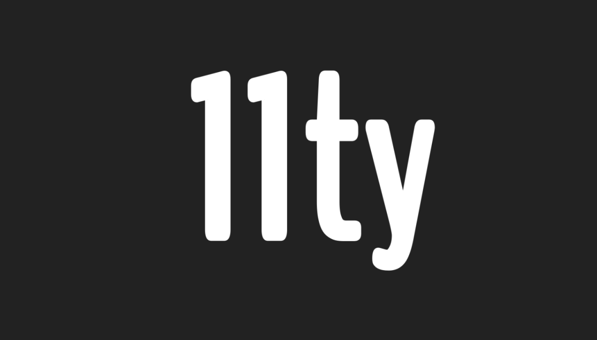

I've been using [Gatsby](https://www.gatsbyjs.org) on my site for ages. I enjoy using it. It's pretty easy to get up and running with, it loads quickly, and it comes with some great plugins like this one for [optimizing images](https://www.gatsbyjs.org/docs/working-with-images/). It deploys easily and has all the benefits of a static site (you don't have to worry about maintaining your own databases or servers). The thing is, though, there's a lot to it.

<!-- excerpt -->

There's no way of avoiding having to use React, Helmet, GraphQL, a complicated build system, tons of plugins, etc. After a fair amount of time, I started feeling pretty disconnected from the HTML/CSS I was trying to produce on my blog.

I'd heard a ton of great stuff about [11ty](https://www.11ty.io), a new static site generator that's supposed to be very simple to use. So I figured I'd give it a try. I moved my site over pretty quickly using their [base blog repo](https://github.com/11ty/eleventy-base-blog), and so far, it feels great being a little "closer to the wire" to my content.

We'll see how it goes.
