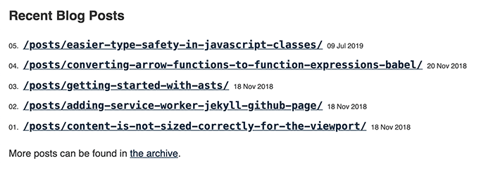

Yesterday, I converted my site to 11ty. I decided to use their [base blog starter](https://github.com/11ty/eleventy-base-blog) and when I did, I noticed this cool UI they have for listing your posts.



When I went to change the styling, I noticed that these numbers get added, entirely with CSS! Let's take a look at how they do this.

This works by combining CSS [counter increment](https://developer.mozilla.org/en-US/docs/Web/CSS/counter-increment) with [CSS counters](https://developer.mozilla.org/en-US/docs/Web/CSS/CSS_Lists_and_Counters/Using_CSS_counters). All you have to do is this:

```html
<ol class="myList">
    <li>One</li>
    <li>Two</li>
    <li>Three</li>
</ol>
```

And then style it with

```css
.myList li {
    counter-increment: start-from 1;
}
.myList li:before {
    content: '' counter(start-from, decimal-leading-zero) '. ';
}
```
