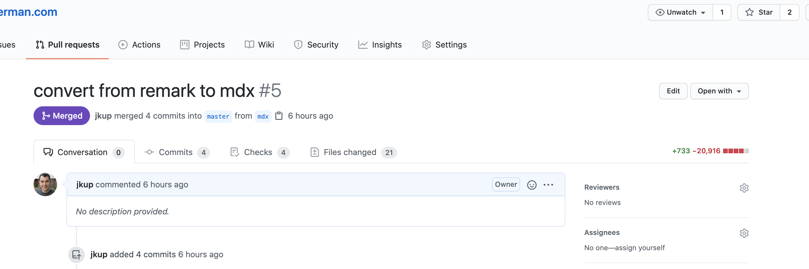

Before we get started, give this bad boy a hover. <Anchor title="BEHOLD" url="#" />

It all started 8 months ago...

I was re-designing my website and found this page with a bunch of amazing CSS hover effects for links. <Anchor title="Check it out!" url="https://tympanus.net/Development/CreativeLinkEffects/" />

## The Problem

I started looking into them and they all have one thing in common. They all require multiple elements to animate. This is unfortunate because I use <Anchor title="Gatsby" url="https://www.gatsbyjs.com/" /> which renders <Anchor title="Markdown" url="https://daringfireball.net/projects/markdown/" /> documents. So I author my pages like:

```markdown
## Title

Some paragraph of text.

Another paragraph of text but this one has [a link](https://jonkuperman.com)
```

I really wanted pretty links but I did not want to wrap every link I write in a span by hand.

So I did what I normally do, I tweeted out a question to the universe and hoped for a response!

<Tweet tweetLink="jkup/status/1252781941264392193" />

As luck would have it, the CEO of Gatsby saw my Tweet and replied:

<Tweet tweetLink="https://twitter.com/kylemathews/status/1252793979319365633" />

## Enter MDX

If you're not familiar, <Anchor title="MDX" url="https://mdxjs.com/" /> is a format that is similar to Markdown but it allows you to add JSX to your documents! This means that I would be able to make a React component like `Anchor` and then update my Markdown like so:

```markdown
## Title

Some paragraph of text.

Another paragraph of text but this one has <Anchor title="a link" url="https://jonkuperman.com" />
```

## Farewell, Remark

Unfortunately for me, I wasn't starting with a fresh Gatsby project. I've had this blog for a while and I'm using **a lot** of plugins that require Remark. The very format I'm trying to move away from!

Fortunately, the Gatsby docs are pretty great. This page on <Anchor title="Migrating Remark to MDX" url="https://www.gatsbyjs.com/docs/how-to/routing/migrate-remark-to-mdx/" /> got me most of the way there! The <Anchor title="MDX plugin for Gatsby" url="https://www.npmjs.com/package/gatsby-plugin-mdx" /> allows you to still run most of your Remark plugins. There were a few that didn't work (like my automatic Tweet embeds!) but most of them had MDX alternatives like <Anchor title="mdx-embed" url="https://www.mdx-embed.com/?path=/docs/introduction--page" />.

## No small change

In the end, I ended up getting rid of **a lot** of Remark plugins. Partly this is due to the flexibility of MDX, but partly I was just using way too many plugins. Anyway the PR turned into a bit of a monster.



## Making the anchor

I'll probably play with this more but as soon as I finished the upgrade I made a new file `utils/mdx.js` and created an `Anchor` component.

```js
import React from 'react';

export function Anchor({ url, title }) {
    return (
        <span className="cl-effect-5" id="cl-effect-5">
            <a href={url}>
                <span data-hover={title}>{title}</span>
            </a>
        </span>
    );
}
```

Then, in `layout.js` I passed the component in as a shortcode.

```js
import { Anchor } from '../utils/mdx';

const shortcodes = { Anchor };

<MDXEmbedProvider>
    <MDXProvider components={shortcodes}>{children}</MDXProvider>
</MDXEmbedProvider>;
```

Finally, in my blog posts like `pretty-links.md` I can just do

```markdown
## Title

Some paragraph of text.

Another paragraph of text but this one has <Anchor title="a link" url="https://jonkuperman.com" />
```

And now I have awesome links. <Anchor title="JUST LIKE I ALWAYS WANTED" url="#" /> The end.
